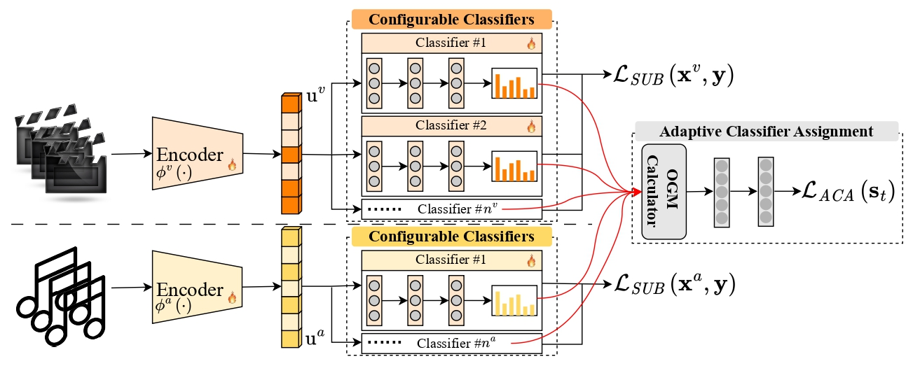

# Rethinking Multimodal Learning from the Perspective of Mitigating Classification Ability Disproportion
This is the official code for the paper "Rethinking Multimodal Learning from the Perspective of Mitigating Classification Ability Disproportion".

## Introduction
The existence of modality imbalance hinders multimodal learning from achieving its expected superiority over unimodal models in practice. To overcome this issue, by designing a sustained boosting algorithm, we propose a novel multimodal learning approach to dynamically balance the classification ability of weak and strong modalities. Concretely, we first propose a sustained boosting algorithm in multimodal learning by simultaneously optimizing the classification and residual errors using a designed configurable classifier module. Then, we propose an adaptive classifier assignment strategy to dynamically facilitate the classification performance of weak modality. To this end, the classification ability of strong and weak modalities is expected to be balanced, thereby mitigating the imbalance issue.

<p align="center">

</p>

## Installation

**Requirements**

* python 3.8
* pytorch 1.11.0
* torchaudio 0.11.0
* torchvision 0.12.0
* opencv 4.9.0.80
* numpy 1.24.4
* scikit-learn 1.3.2
* transformers 4.36.2

## Pretrained model for NVGesture

Model Download [link](https://github.com/piergiaj/pytorch-i3d/tree/master/models)

## Dataset

Download Dataset: 

1. CREMAD Dataset [CREMAD](https://github.com/CheyneyComputerScience/CREMA-D)

2. Kinetics-Sounds Dataset [Kinetics-Sounds](https://github.com/cvdfoundation/kinetics-dataset)

3. NVGresutre Dataset [NVGresutre](https://research.nvidia.com/publication/2016-06_online-detection-and-classification-dynamic-hand-gestures-recurrent-3d)

Data Pre-processing

You can prepare the data according the instructions of the cited paper.

## Training

For training, we provide hyper-parameter settings in `./data/`. You can running command for each dataset.

### CREMA-D

```bash
$ python train_CREMAD.py --config ./data/crema.json
```

### Kinetics-Sound

```bash
$ python train_KS.py --config ./data/kinetics_sound.json
```

### NVGesture

```bash
$ python train_NVGesture.py --config ./data/nvGesture.json
```
