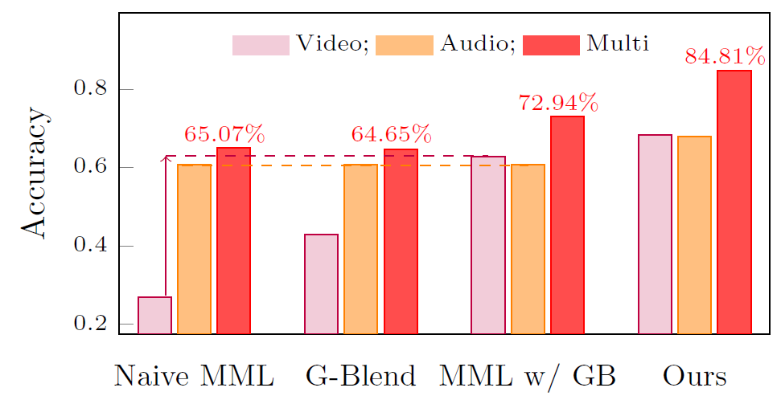

# Rethinking Multimodal Learning from the Perspective of Mitigating Classification Ability Disproportion

This repo is the official implementation of AUG proposed in "Rethinking Multimodal Learning from the Perspective of Mitigating Classification Ability Disproportion".

**Paper Title: "Rethinking Multimodal Learning from the Perspective of Mitigating Classification Ability Disproportion"**

**Authors: [Qingyuan Jiang](https://jiangqy.github.io/), [Longfei Huang](https://hlf404.github.io/), and [Yang Yang](http://home.njustkmg.cn:4056/Introduction-cn.html)**

**Accepted by: NIPS 2025, Oral**

**[[arXiv]()]** 

## ✨ Motivation

### **What is the modality imbalance challenging in multimodal learning?**

Multimodal Learning (MML) is expected to achieve better performance compared with unimodal approaches. However, contrary to expectations, MML has been surprisingly shown to underperform compared to unimodal ones in certain scenarios. **Capability discrepancies across heterogeneous models play a crucial role in causing modality imbalance.**

## 📖 Overview

### **What do we do to balance the model capability?**

We propose AUG approach to dynamically balance the classification ability of weak and strong modalities. Firstly, we propose a sustained boosting algorithm in multimodal learning by simultaneously optimizing the classification and residual errors. Subsequently, we introduce an adaptive classifier assignment strategy to dynamically facilitate the classification performance of the weak modality. We mitigate the imbalance issue as shown in the following figure.

<div  align="center">    

</div>

## 🚀 Quick Start

## Requirement

* python 3.8
* pytorch 1.11.0
* torchaudio 0.11.0
* torchvision 0.12.0
* opencv 4.9.0.80
* numpy 1.24.4
* scikit-learn 1.3.2
* transformers 4.36.2

### Data Preparation

This repository needs CREMAD, Kinetics-Sounds, Sarcasm, Twitter15, VGGSound, and NVGresutre Datasets.
Download Original Dataset：
[CREMA-D](https://github.com/CheyneyComputerScience/CREMA-D),
[Kinetics-Sounds](https://github.com/cvdfoundation/kinetics-dataset),
[Sarcasm](https://github.com/feiLinX/Multi-modal-Sarcasm-Detection),
[Twitter15](https://github.com/jefferyYu/TomBERT),
[VGGSound](https://www.robots.ox.ac.uk/~vgg/data/vggsound/),
[NVGresutre](https://research.nvidia.com/publication/2016-06_online-detection-and-classification-dynamic-hand-gestures-recurrent-3d),

The data processing details are in [OGM-GE](https://github.com/GeWu-Lab/OGM-GE_CVPR2022/tree/main) and [AMSS](https://github.com/njustkmg/TPAMI-AMSS).

### RUN

We provide hyper-parameter settings in `/data/`. The code uses the CREMA-D dataset as an example. You can simply run the code using:

```bash
$ python train_CREMAD.py --config ./data/crema.json
```

## 📘 Citation

If you find this work useful, consider giving this repository a star ⭐️ and citing 📑 our paper as follows:

```bibtex
@inproceedings{Jiang2025aug,
  title={Rethinking Multimodal Learning from the Perspective of Mitigating Classification Ability Disproportion},
  author={Qingyuan Jiang and Longfei Huang and Yang Yang},
  booktitle={NeurIPS},
  year={2025},
}
```

## Acknowledgememnt

We thank the following repos providing helpful components/functions in our work. 
* [OGM-GE](https://github.com/GeWu-Lab/OGM-GE_CVPR2022),
* [AMSS](https://github.com/njustkmg/TPAMI-AMSS).
